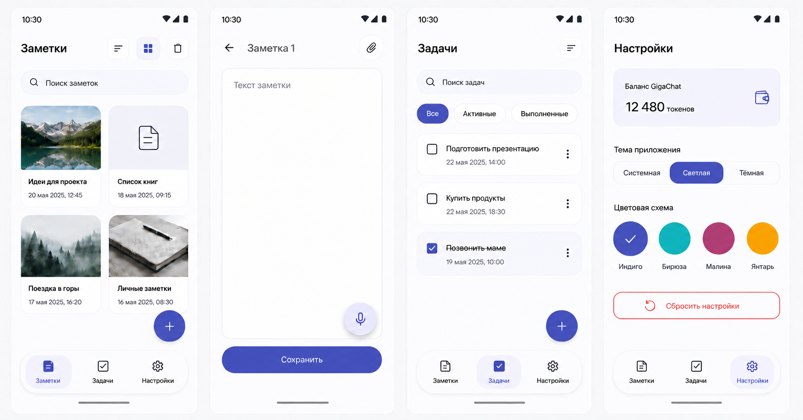
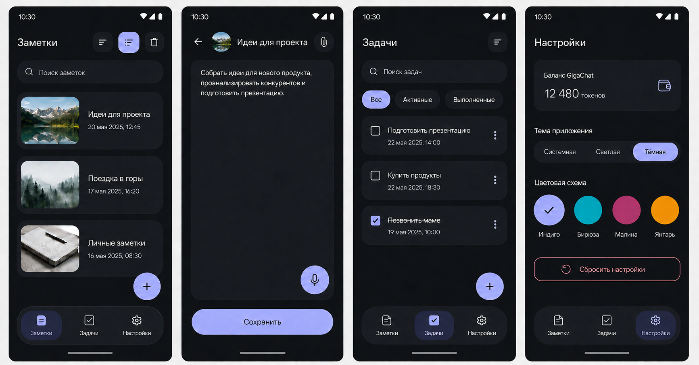
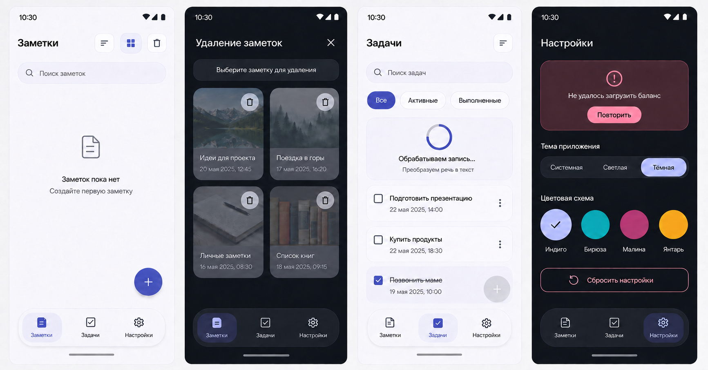
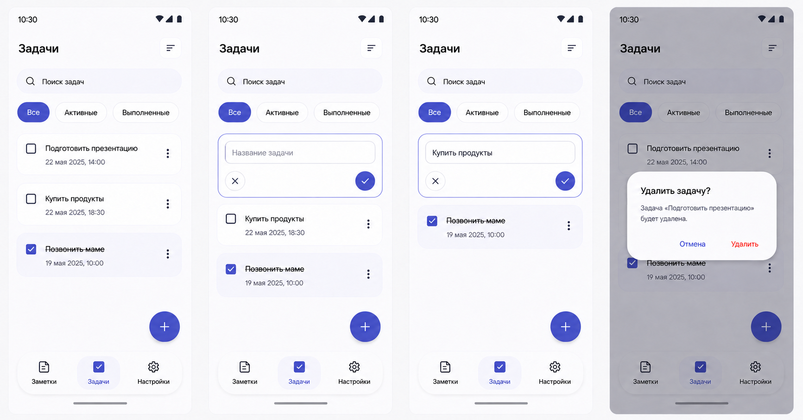
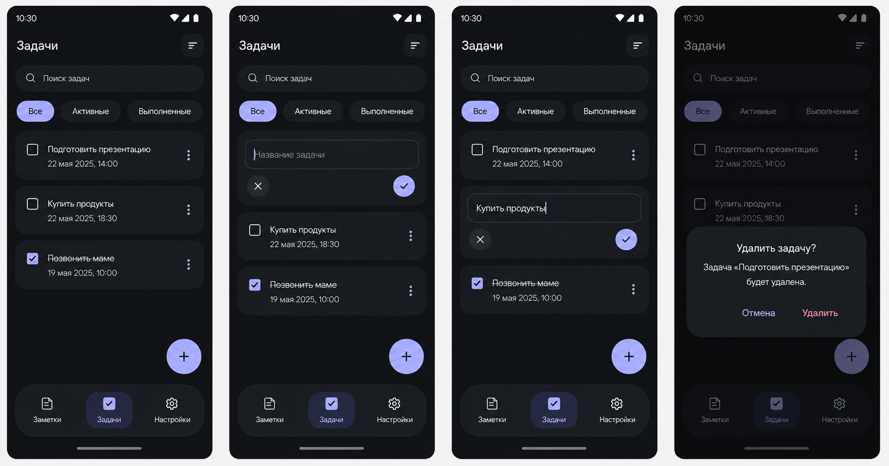
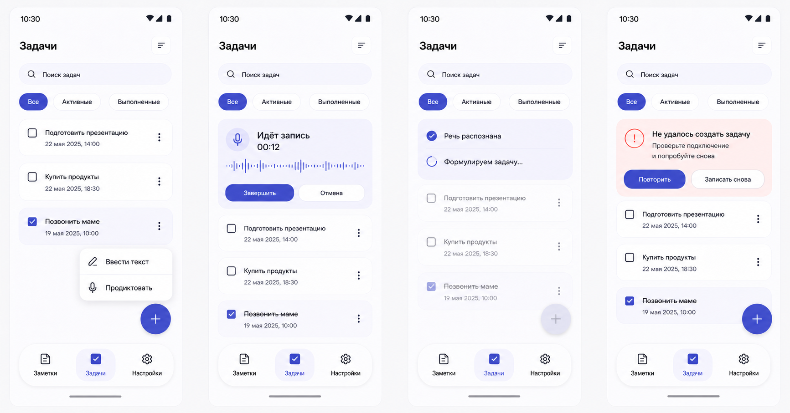
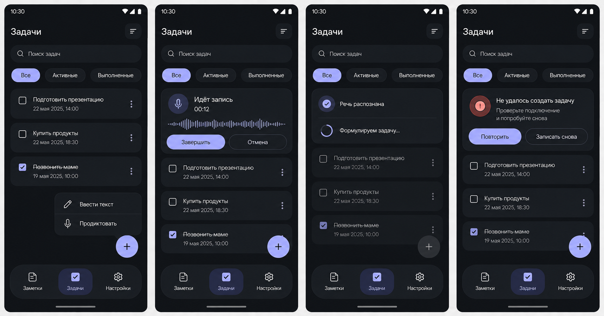

# Дизайн NotesApp

Этот раздел фиксирует исходную визуальную концепцию приложения заметок и задач. Текстовые спецификации являются источником истины для будущей реализации; растровые макеты показывают характер и общую композицию интерфейса.

## Состав

- [Дизайн-система](design-system.md): темы, акцентные палитры, типографика, формы, отступы, размеры и общие состояния.
- [Навигация](navigation.md): Bottom Navigation и переходы между верхнеуровневыми разделами и редактором.
- [Заметки](screens/notes.md): список, поиск, сортировка и режим удаления.
- [Редактор заметки](screens/note-editor.md): создание, просмотр, редактирование, изображение и голосовой ввод.
- [Задачи](screens/tasks.md): список, фильтры, inline-создание/редактирование, удаление и голосовой сценарий.
- [Настройки](screens/settings.md): баланс GigaChat, тема, акцент и сброс.
- [Splash](screens/splash.md): запуск приложения и двухфазная анимация launcher icon.
- [Макеты](mockups/README.md): визуальные доски и использованные запросы генерации.

## Рамки решения

- Основной целевой форм-фактор — компактный Android-смартфон шириной от 360 dp.
- Интерфейс строится на Material 3, но получает собственные статические цветовые схемы. Dynamic color отключён.
- По умолчанию используются системная светлая/тёмная тема и палитра «Индиго».
- Bottom Navigation присутствует только на трёх корневых экранах. Редактор заметки — вложенный экран без нижней навигации.
- Опциональное переключение List/Grid из `task.md` включено для Notes после отдельного запроса пользователя; выбранный режим сохраняется локально.
- По отдельному запросу пользователя для Tasks добавлены inline-редактирование и удаление с подтверждением. Это расширение `task.md`, но оно не создаёт новых навигационных экранов.
- Форматирование текста и пагинация не включены в эту концепцию; подтверждение удаления заметки, Share и Splash добавлены по отдельным запросам пользователя.
- Каждая спецификация и каждое состояние поддерживают обе темы. Раздельные light/dark-доски ниже показывают это явно.

## Визуальные ориентиры

## Основание

Концепция следует системам цвета, типографики и форм Material 3, паттерну Navigation Bar для трёх равнозначных корневых направлений и подходу Now in Android, где тема и общие UI-компоненты сосредоточены в design system.

- [Material 3 in Compose](https://developer.android.com/develop/ui/compose/designsystems/material3)
- [Navigation bar](https://developer.android.com/develop/ui/compose/components/navigation-bar)
- [Android color guidance](https://developer.android.com/design/ui/mobile/guides/styles/color)
- [Compose accessibility defaults](https://developer.android.com/develop/ui/compose/accessibility/api-defaults)
- [Now in Android: modularization](https://github.com/android/nowinandroid/blob/main/docs/ModularizationLearningJourney.md)
