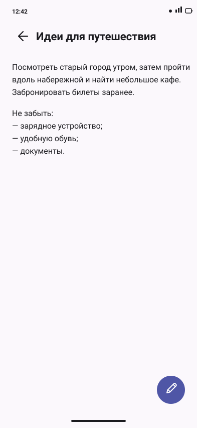

# Экран Note Editor

> Статус: утверждено.

## Назначение

Один вложенный экран создаёт новую заметку и загружает существующую для чтения и редактирования. Новая заметка сразу открывается в Creating, существующая — в Reading. FAB с карандашом переводит Reading в Editing без добавления нового navigation destination. Creating и Editing используют одинаковое редактируемое представление. Полностью пустая заметка не сохраняется: пользователь должен заполнить заголовок или текст; изображение опционально.

## Иерархия

### Reading

1. Top App Bar: Back, статический заголовок заметки и действие «Поделиться» на одной горизонтали.
2. Прокручиваемый статический текст заметки без рамки, заливки, label или отдельного контейнера.
3. Primary FAB с карандашом: «Редактировать заметку».

### Creating и Editing

1. Top App Bar: Back, optional attachment thumbnail, inline title, paperclip action.
2. Многострочное поле «Текст заметки».
3. Voice input FAB.
4. Voice/status panel при активном сценарии.
5. Primary-кнопка «Сохранить».

Bottom Navigation отсутствует. Экран вертикально прокручивается. В Reading FAB не перекрывает последние строки текста. В Creating и Editing Save остаётся последним элементом content и поднимается над IME.

Геометрия следует обновлённой мягкой системе: body field и voice panel имеют радиус 24dp, icon actions, Voice FAB и Save — форму capsule/circle. Под изображение не резервируется место.

В Reading используются те же типографические токены, что и в редактируемом представлении: `titleLarge` для заголовка и `bodyLarge` для текста. Размер шрифта при переключении режима не меняется.

## Wireframe

### Reading

```text
┌──────────────────────────────────┐
│ ←  Идеи для путешествия          │
│                                  │
│ Посмотреть старый город утром,   │
│ затем пройти вдоль набережной.   │
│ Забронировать билеты заранее.    │
│                                  │
│                           ( ✎ )  │
└──────────────────────────────────┘
```



### Creating и Editing

```text
┌──────────────────────────────────┐
│ ←  Заметка 1              clip │
│ [ Текст заметки                  │
│                                  │
│                                  │
│                                ] │
│                       ( mic )   │
│                                  │
│ [          Сохранить           ] │
└──────────────────────────────────┘
```

## Состояния

| Состояние | Представление | Поведение |
| --- | --- | --- |
| Loading existing | top bar + skeleton/centered progress «Загружаем заметку…» | Back доступен, редактирование недоступно |
| New content | серый placeholder «Заголовок вашей заметки» в app bar, пустой body, paperclip; image placeholder отсутствует; Save имеет disabled-оформление | ввод title/body, voice, attachment; Save становится доступна после заполнения любого из полей |
| Reading без изображения | Back, сохранённый title и Share в Top App Bar; ниже обычный статический body; Edit FAB | Back возвращает в Notes, Share отправляет title и body через системный chooser, Edit FAB включает Editing |
| Reading с изображением | Back, thumbnail, сохранённый title и Share; ниже обычный статический body; Edit FAB | thumbnail открывает preview/actions, Share отправляет текст заметки, Edit FAB включает Editing |
| Editing | то же редактируемое представление, что и New content, с загруженными title/body | Back отменяет несохранённые изменения и возвращает Reading; Save обновляет запись и возвращает Reading |
| Image picking/camera | modal bottom sheet «Добавить изображение»: «Выбрать файл», «Сделать фото» | sheet закрывается после выбора или отмены |
| Image attached | небольшая круглая thumbnail в app bar | tap: просмотреть, заменить или удалить |
| Closing during image processing | поля, Save и attachment actions disabled; progress «Закрываем редактор…» | после завершения обработки временные файлы удаляются и редактор закрывается |
| Saving | progress внутри Save, поля и attachment actions временно disabled | Back не запускает второе сохранение |
| Load/save error | полный error state при загрузке; inline error banner при сохранении | «Повторить»; введённый текст не теряется |
| Voice recording | Voice FAB меняется на Stop; status panel и timer без дополнительных действий | остановить запись через FAB |
| Voice processing | Voice FAB disabled/progress + «Распознаём речь…» | поля видны; Save disabled до завершения |
| Voice error | Snackbar с короткой причиной | повторно запустить ввод через Voice FAB |
| Permission denied | modal dialog поверх редактора, поля и введённый текст остаются на месте | «Разрешить» при временном отказе; «Открыть настройки», если системный запрос больше нельзя показать; «Не сейчас» закрывает dialog |

### Переходы Creating, Reading и Editing

- `NoteEditorRoute(null)` открывает Creating. Успешный Save создаёт заметку и возвращает в Notes.
- `NoteEditorRoute(noteId)` проходит Loading и открывает Reading.
- Edit FAB переводит тот же route и ViewModel из Reading в Editing.
- Back в Editing отменяет несохранённый ввод и восстанавливает последнее сохранённое Reading. Новый navigation entry не создаётся.
- Ошибка обновления оставляет пользователя в Editing, сохраняет введённые данные и показывает retryable error banner.
- Успешный Save в Editing обновляет существующую запись и сразу возвращает Reading с новыми title/body.
- Back в Reading возвращает в Notes.

### Inline title и имя по умолчанию

- В новой заметке между Back/thumbnail и paperclip отображается серое «Заголовок вашей заметки» в стиле placeholder, без рамки отдельного поля.
- Если пользователь оставляет title пустым, но вводит body, при сохранении применяется `Заметка N`. `N` — следующий уникальный номер автоматически названной заметки; он не меняется во время текущей сессии редактора.
- Tap переводит inline title в фокус. При вводе первого символа серое предлагаемое имя исчезает, пользовательский title отображается `onSurface`.
- «Заголовок вашей заметки» остаётся placeholder и не считается введённым title.
- Save недоступна, только если и title, и body пусты либо состоят из пробелов. ViewModel повторно проверяет это условие перед сохранением.
- Для существующей заметки сразу показывается сохранённый title обычным цветом. Если пользователь полностью его очистил, при непустом body применяется тот же fallback `Заметка N`.
- Вне фокуса длинный title занимает одну строку и обрезается ellipsis; в фокусе поле прокручивается горизонтально. Полный текст остаётся доступен accessibility services.

### Изображение и разрешения

- В состоянии без изображения нет placeholder, preview card или пустого блока в content.
- Круглая paperclip action 48dp в Top App Bar открывает source sheet.
- Для системного Photo Picker/SAF отдельное storage-разрешение не запрашивается, если оно не требуется платформой.
- Camera и microphone permissions запрашиваются непосредственно перед соответствующим действием.
- При отказе открывается modal dialog «Доступ к камере», пользователь остаётся на экране, поля не очищаются.
- При временном отказе dialog позволяет повторить системный запрос. При окончательном запрете он ведёт в настройки приложения. «Не сейчас» закрывает dialog без изменения заметки.
- Ошибка нового изображения сообщает, что изменения текста остались в редакторе и ещё не сохранены. Она не утверждает, что Room уже обновлён.
- Ошибка чтения ранее сохранённого изображения сообщает только о недоступности вложения и не смешивается с ошибкой нового черновика.
- Back в Creating во время обработки блокирует дальнейший ввод, дожидается очистки результата и затем закрывает редактор.
- После выбора рядом с Back появляется круглая thumbnail 40dp внутри touch target 48dp. Она не сдвигает title за пределы доступной ширины.
- Tap по thumbnail открывает attachment sheet с большим временным preview и действиями «Заменить изображение» и «Удалить изображение». После закрытия sheet большой preview исчезает.
- Paperclip остаётся доступной и при выбранном изображении; её описание меняется на «Заменить изображение».
- Thumbnail имеет описание «Прикреплённое изображение. Открыть действия»; delete action — «Удалить изображение из заметки».

### Голосовой ввод

- В idle-состоянии используется круглый Voice FAB 56dp: `primary` / `onPrimary`, небольшая elevation.
- FAB закреплён в нижнем правом углу editor content на 16dp выше Save. Body получает внутренний bottom inset, поэтому FAB не закрывает текст и caret.
- Во время записи иконка FAB меняется с mic на Stop. Во время обработки FAB disabled и показывает progress либо сопровождается progress в status panel.
- Запись добавляет распознанный текст в конец body.
- Если body не пустой и не заканчивается whitespace, перед вставкой добавляется пробел или перевод строки.
- Ошибка записи/распознавания не изменяет существующий текст.
- Processing имеет live-region semantics, но прогресс не объявляется на каждом кадре.

## Структура Compose-компонентов

```text
feature/notes/impl/presentation/editor/
|-- NoteEditorRoute.kt
|-- NoteEditorUiState.kt
|-- NoteEditorViewModel.kt
|-- NoteEditorEvent.kt
|-- screens/
|   |-- NoteEditorScreen.kt
|   |-- NoteEditorReadingScreen.kt
|   |-- NoteEditorLoadingScreen.kt
|   |-- NoteEditorErrorScreen.kt
|   `-- NoteEditorContentScreen.kt
`-- components/
    |-- NoteEditorTopBar.kt
    |-- NoteReadingTopBar.kt
    |-- EditNoteFab.kt
    |-- InlineNoteTitleField.kt
    |-- NoteBodyField.kt
    |-- EditorAttachmentThumbnail.kt
    |-- ImageSourceSheet.kt
    |-- ImageAttachmentActionsSheet.kt
    |-- EditorVoiceInputFab.kt
    |-- EditorVoiceStatusPanel.kt
    `-- SaveNoteButton.kt
```

Общий визуальный шаблон voice status переиспользует tokens и state semantics дизайн-системы, но редакторский panel остаётся в пакете экрана, пока не появится вторая идентичная реализация.

## Accessibility и длинный текст

- Inline title имеет label semantics «Заголовок заметки»; серый placeholder объявляется как подсказка, а не как уже введённый пользовательский текст.
- В Reading title остаётся на одной горизонтали с Back, занимает оставшуюся ширину и обрезается ellipsis; полный title остаётся доступен accessibility services.
- Статические title и body в Reading можно выделить и скопировать; пользовательские переносы строк сохраняются.
- Edit FAB: «Редактировать заметку»; декоративная иконка карандаша не получает отдельное описание.
- Back: «Назад»; paperclip: «Добавить изображение» или «Заменить изображение»; camera: «Сделать фото»; file: «Выбрать изображение»; mic сообщает recording state.
- Voice FAB объявляется как «Начать голосовой ввод», «Остановить запись» или «Распознаём речь» в зависимости от состояния.
- Высота body растёт до разумного минимума и затем прокручивает весь экран; системный font scale не ограничивается.
- При крупном font scale thumbnail остаётся после Back, title занимает доступную ширину и обрезается ellipsis вне фокуса, а paperclip сохраняет touch target 48dp.
